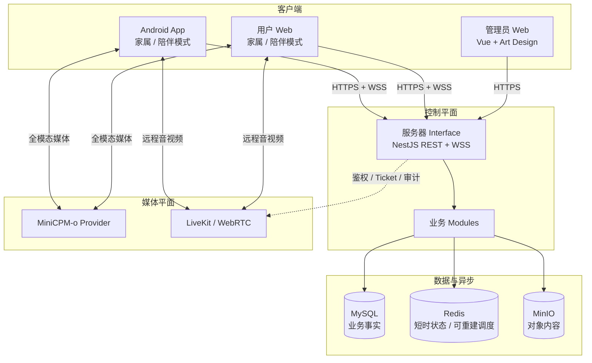

# 总体架构

## 1. 架构结论

服务器采用模块化单体。每个业务 Module 通过小型 Interface 暴露完整用例，复杂规则保留在 Implementation 内部；这为客户端提供 Leverage，也让修改、测试和审计保持 Locality。第一阶段不把模块部署成微服务。

独立源文件见 [system-architecture.mmd](./diagrams/system-architecture.mmd)。

## 2. 控制平面与媒体平面

### 2.1 控制平面

由 `server-api` 负责：

- 身份认证、家庭权限和设备身份。
- 资料、日程、事件、待办和授权。
- 设备在线状态与一次性激活。
- 远程会话创建、邀请、授权、信令和审计。
- MiniCPM-o 会话策略、Prompt 版本和业务事件闭环。

### 2.2 媒体平面

大体积、低延迟媒体不经过普通 REST Interface：

- MiniCPM-o 音视频由陪伴客户端连接选定的模型 Adapter。
- 家属与陪伴设备的实时通话使用 WebRTC；服务器只处理资格和信令，TURN 仅在无法点对点连接时转发加密媒体。
- 图片和音频文件使用预签名 URL 直接传入 MinIO，服务器完成意图创建、校验和最终确认。

控制平面失败时，客户端不得把模型输出或媒体状态伪装成已经提交的业务事实。

## 3. 四个部署物

### 3.1 server-api

- 唯一业务事实写入口。
- 暴露版本化 REST Interface 和实时 WebSocket Interface。
- 使用 Prisma transaction 保证单库一致性，使用 Outbox 保证事务后的通知和异步任务。
- 使用后台 Worker 生成日程实例、处理超时、清理过期激活码和执行保留策略。

### 3.2 admin-web

- 复用 Art Design Clean 的布局、表格、主题、Pinia 和动态路由。
- 删除模板 Mock 数据和前端伪角色切换。
- 管理员登录与普通用户登录采用不同受众的令牌。
- 内容检查页面必须携带检查理由和 Inspection Grant，不能直接复用家庭详情页面。

### 3.3 client-web

- 迁移当前 React Demo 的陪伴 UI、Agent 状态显示和模型运行时。
- 增加真正的登录、家庭工作区、服务器数据同步和远程通话。
- 家属/陪伴模式使用独立路由树和状态容器，只共用设计系统、网络层和安全会话。

### 3.4 client-android

- 复用 `minicpmo-Android` 的 CameraX、双工音频和 ModelBest 协议。
- 采用按功能拆分的 Compose 导航、ViewModel、用例、Repository 和本地缓存。
- 陪伴模式可启用前台常驻会话；进入后台时必须遵守 Android 对摄像头和麦克风的限制。
- 激活完成后使用 Device Identity，不长期复用家属访问令牌。

## 4. 数据所有权

| 数据 | 权威 Module | 其他 Module 如何使用 |
| --- | --- | --- |
| User、Login Identity、User Session | Identity | 只引用 `userId` |
| Household、Member、Care Authority | Household | 通过授权查询 Interface |
| Care Recipient、Memory、Routine | Care Profile / Routine | 通过快照或领域事件 |
| Companion Session、Conversation Turn | Companion Session | 通过会话摘要和事件 |
| Remote Assistance Session | Realtime Communication | 通过 Join Ticket 和终态事件 |
| Audit Entry、Inspection Grant | Platform Operations | 通过审计 Interface，业务表不得自行伪造 |

每张表只有一个拥有者 Module。跨 Module 不直接写表，避免业务规则散落。

## 5. 真实 Seam 与 Adapter

只有存在实际替换需求的依赖才建立 Seam：

| Seam | 生产 Adapter | 测试或替代 Adapter |
| --- | --- | --- |
| 模型 Provider | ModelBest / Ascend 本地部署 | Replay / Fake Model |
| 对象存储 | MinIO | 内存或临时目录 Adapter |
| 通知 | 邮件 / Android 推送 | Recording Adapter |
| 时间 | System Clock | Fake Clock |
| 随机码 | Cryptographic Generator | Deterministic Generator |
| 实时媒体资格 | WebRTC Adapter | In-memory Signaling Adapter |

Prisma 是 MySQL 的具体 Implementation；业务 Module 不为每张表制造浅层 Repository。测试优先通过 Module Interface 运行真实临时数据库，只有远程依赖使用替代 Adapter。

## 6. 一致性策略

- 同一个命令内需要共同成功的数据使用一个 Prisma transaction。
- 数据库事务提交后才通过 `outbox_events` 发布通知和实时更新。
- 客户端写操作携带 `Idempotency-Key`；创建激活、确认、结束会话等命令必须幂等。
- 可编辑资料携带 `version`，冲突返回当前版本，不使用最后写入者静默覆盖。
- WebSocket 事件只用于加速界面，断线后客户端用 REST 增量同步恢复。
- Redis 丢失后可从 MySQL 重建在线外的业务状态；在线状态本身允许自然过期。
- 资产扫描、永久删除和其他隐私关键任务先在同一 MySQL 事务写入持久 Outbox，并由数据库租约安全认领；Redis 只能承担可重建的唤醒或调度加速，不能成为此类任务唯一队列。该取舍见 [ADR-0006](../adr/0006-durable-outbox-for-privacy-lifecycle-jobs.md)。

## 7. 可观测性

每个请求、后台任务、模型会话和远程会话使用可关联的 ID：

- `requestId`
- `userSessionId` 或 `deviceIdentityId`
- `householdId`
- `careRecipientId`
- `companionSessionId`
- `remoteAssistanceSessionId`
- `modelSessionId`

日志不得直接写密码、令牌、动态码、原始音视频、完整 Prompt、可信记忆正文或对话原文。
