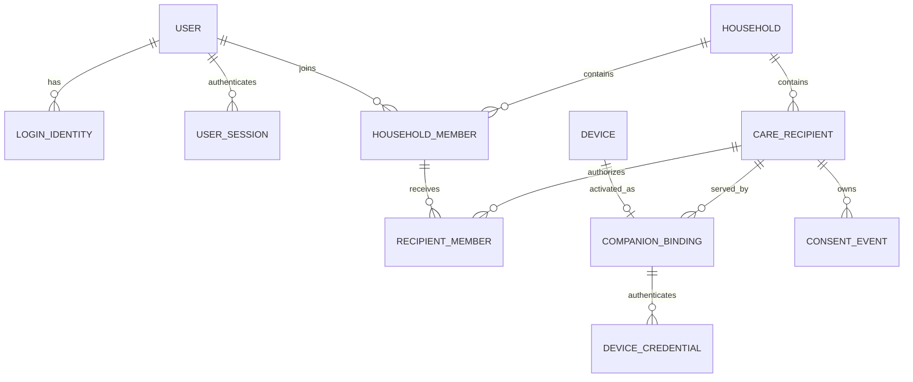

# 数据库与 ER 设计

## 1. 数据库职责

MySQL 是账号、授权、资料、日程、事件、会话生命周期和审计的唯一业务事实源。Redis 只保存可过期、可重建的在线状态、媒体租约、限流和任务队列；MinIO 只保存对象内容，任何对象都必须先有 MySQL 元数据和授权关系。

## 2. 全局物理约定

| 主题 | 约定 |
| --- | --- |
| 主键 | 应用层生成 ULID，`CHAR(26)`；不向客户端暴露自增规模 |
| 时间 | UTC `DATETIME(3)`；日程额外保存 IANA 时区和本地日期 |
| 状态 | `VARCHAR(32)` + TypeScript 常量；不使用 MySQL `ENUM` |
| 令牌/摘要 | SHA-256 等固定摘要使用 `BINARY(32)`；明文不入库 |
| 并发 | 可变聚合使用 `version` 乐观锁 |
| 租户隔离 | 所有家庭业务表包含 `household_id`，关键关联使用家庭范围复合约束 |
| 删除 | 关联表可级联；事件、授权、会话、审计不得级联删除 |
| JSON | 只用于快照和不可查询协议元数据；权限、状态和关系必须是列 |
| 敏感原文 | 应用层信封加密，保存密文、Nonce、密钥版本和内容哈希 |
| 迁移 | 生产只运行 `prisma migrate deploy`，不用 `db push` 替代迁移 |

## 3. ER 图分区

完整模型按可读性拆成三张图：

- [身份、家庭、设备与授权](./diagrams/er-core.mmd)
- [记忆、日程、事件与对象](./diagrams/er-care.mmd)
- [模型会话、远程会话、通知与审计](./diagrams/er-session-ops.mmd)

### 3.1 核心关系摘要

## 4. 关键聚合及不变量

### 4.1 User 与登录

- 一个 User 可同时有一个用户名和多个经过验证的邮箱，`(type, normalized_value)` 全局唯一。
- 用户名禁止 `@`，邮箱统一小写；用户名执行 Unicode NFKC 和大小写规范化。
- User Session 使用刷新令牌族轮换；旧令牌重放时撤销整个 token family。
- 登录失败短时计数在 Redis，锁定结论和安全审计进入 MySQL。

### 4.2 Household、Member 与 Care Recipient

- 一个 User 可以加入多个 Household；一个 Household 可以有多个 Care Recipient。
- `Household Member` 描述家庭身份，`Recipient Member` 描述对某个陪伴对象的实际权限。
- 不允许移除家庭最后一个 OWNER。
- Care Recipient 默认没有 User；未来需要本人账号时通过可空 `linked_user_id` 关联，不改变现有数据模型。

### 4.3 Device 与 Companion Binding

- Device 表示一次 App 或浏览器安装，不采集 IMEI、Android ID 等永久硬件标识。
- Device 必须显式保存 `installation_key_algorithm`（`ED25519` 或 `ECDSA_P256_SHA256`）和 `key_protection=NON_EXPORTABLE_V1` 才能进入激活或设备鉴权链路；迁移前安装统一标记为 `LEGACY_UNVERIFIED` 并撤销，两个字段不提供默认值以阻止旧服务创建可用设备。
- 一台设备同一时刻只允许一个当前 Companion Binding；历史写入不可变的 Binding Event。
- MySQL 没有通用部分唯一索引，当前绑定使用独立当前表或自定义生成列约束，不能依赖 `UNIQUE(device_id, status)`。
- 激活成功后签发 Device Credential，家属 User Session 从陪伴模式清除。

### 4.4 Consent

- `recipient_consent_states` 是当前投影，`recipient_consent_events` 是不可变历史。
- 更新当前授权与追加授权事件必须处于同一个事务。
- 撤回摄像头、麦克风、公网处理、远程媒体或敏感记忆授权时，通过 Outbox 终止相关会话并收缩后续快照。

### 4.5 Memory 与 Asset

- `memories` 保存当前索引信息；正文版本进入不可变的 `memory_revisions`。
- MinIO 文件通过有真实外键的 `memory_assets`、`recipient_assets`、`medication_assets` 等表关联，不使用万能 `resource_type/resource_id`。
- 对象删除分两阶段：数据库标记 `PENDING_DELETE`，Worker 删除 MinIO，成功后标记 `DELETED`。

### 4.6 Routine 与 Routine Occurrence

- Routine 是长期定义，Schedule 是带版本的触发规则，Occurrence 是一次实际任务。
- `UNIQUE(schedule_id, scheduled_at_utc)` 防止重复生成实例。
- 修改 Schedule 不重算已经生成的 Occurrence。
- 模型永远不能成为 Confirmation 的 actor；本人按钮/语音回执与家属核验分别记录来源。

### 4.7 Care Event 与 Family Task

- Care Event 是不可变事实，是否已处理由 Family Task 表达。
- `dedupe_key` 在家庭范围唯一，防止重试产生重复事件。
- Family Task 使用 `version` 防止两个家属同时处理时静默覆盖。

### 4.8 Model Session 与对话原文

- 全双工发言可能重叠，因此使用 `Conversation Utterance`，不假定严格轮流 Turn。
- 发言元数据和加密原文分表，便于独立清除原文而保留会话指标。
- `memory_usage_records` 记录某次模型表达实际引用的 Memory Revision，支持比赛解释性和回归评估。
- 不把每个音频 chunk、视频帧或 WebSocket 消息写入 MySQL。

### 4.9 Remote Assistance Session

- 当前模型是一次会话对应一台 Companion Binding 和一名发起家属；后续 LiveKit 房间可增加受控参与者。
- MySQL 保存生命周期和授权快照，Redis 保存在线、短时票据和媒体排他租约。
- `ACTIVE` 必须由媒体服务器 Webhook 确认双方加入且陪伴端发布必要轨道，不能只信任客户端按钮。
- `room_provisioned_at` 是首张票之前的持久建房栅栏：只有锁定会话行的建房事务成功提交后才非空；其后所有参与者复用同一房间，不再发起 CreateRoom。
- `room_cleanup_status/room_cleanup_completed_at/room_cleanup_not_before` 记录终态删房屏障、完成检查点及保守重删窗口；清理未完成前不得释放对应 Binding 的媒体隔离租约。
- 默认不录制；媒体服务器房间名使用不可猜测随机值，令牌和媒体密钥不入库。

## 5. 索引计划

| 表 | 关键索引或唯一约束 |
| --- | --- |
| `login_identities` | `UNIQUE(type, normalized_value)` |
| `user_sessions` | `UNIQUE(refresh_token_hash)`；`(user_id, revoked_at, expires_at)`；`(user_id, purpose, revoked_at, expires_at)` |
| `household_members` | `UNIQUE(household_id, user_id)` |
| `recipient_members` | `UNIQUE(recipient_id, household_member_id)` |
| `device_activation_challenges` | `UNIQUE(public_id)`；`UNIQUE(secret_hash)`；`UNIQUE(approval_idempotency_key)`；`(status, expires_at)` |
| `family_task_actions` | `UNIQUE(idempotency_key)`；`(task_id, occurred_at)` |
| `care_command_receipts` | `UNIQUE(idempotency_key)`；`(command_type, created_at)`；完整命令 SHA-256 与首次响应快照 |
| `remote_session_participants` | `UNIQUE(join_ticket_id)`；`(join_ticket_status, join_ticket_expires_at)` |
| `device_credentials` | `UNIQUE(credential_hash)`；`(binding_id, revoked_at, expires_at)` |
| `recipient_consent_states` | `UNIQUE(recipient_id, scope)` |
| `memory_revisions` | `UNIQUE(memory_id, revision_no)` |
| `tags` | `UNIQUE(household_id, normalized_name)` |
| `assets` | `UNIQUE(bucket, object_key)`；`(status, retention_until)` |
| `routine_occurrences` | `UNIQUE(schedule_id, scheduled_at_utc)`；`(recipient_id, status, scheduled_at_utc)` |
| `care_events` | `UNIQUE(household_id, dedupe_key)`；`(recipient_id, occurred_at)` |
| `conversation_utterances` | `UNIQUE(session_id, sequence_no)`；`UNIQUE(session_id, provider_event_id)` |
| `remote_assistance_sessions` | `(binding_id, status, requested_at)`；`(household_id, requested_at)` |
| `audit_logs` | `(household_id, occurred_at)`；`(actor_user_id, occurred_at)`；`(resource_type, resource_id, occurred_at)` |
| `outbox_events` | `(published_at, available_at)`；`(lease_until)` |

## 6. 事务边界

以下操作必须各自在一个短事务中完成：

1. 创建家庭，同时创建 OWNER Member 和 Recipient Member 权限。
2. 批准设备激活，同时消费 Challenge、建立 Binding、签发凭据摘要、写事件和 Outbox。
3. 撤销设备，同时撤销凭据、关闭当前绑定、写历史和 Outbox。
4. 授权变化，同时写当前状态和不可变事件。
5. 创建或更新 Memory，同时追加 Revision 和附件关系。
6. 记录 Confirmation，同时迁移 Occurrence、关闭开放 Family Task、写 Care Event 和 Outbox。
7. 发起 Remote Assistance，同时快照授权、创建会话并取得 Redis 媒体租约；租约失败则回滚。
8. 签发 Inspection Grant 和执行 Content Inspection 时分别写 Audit Entry。

事务内禁止调用 MiniCPM-o、MinIO、LiveKit、邮件或推送网络接口。远程会话首次建房拆成两个短 SERIALIZABLE 事务：前一事务锁定会话行并选定唯一 `PROVISIONING` owner，事务外执行有 3 秒硬超时的 LiveKit CreateRoom，后一事务重新锁定会话行并原子提交 `room_provisioned_at` 与 `ROOM_READY`；只有后一事务成功后才允许签首张票。并发请求不能成为第二个建房者，失败或超时必须终止整个会话。

## 7. 删除与保留

| 数据 | 默认策略 |
| --- | --- |
| 用户会话 | 过期后保留安全摘要一段审计期，再清除 |
| 激活 Challenge | 终态后短期保留元数据，秘密摘要可提前清除 |
| Memory Revision | 版本追加；删除进入保留期后清除密文 |
| Conversation Content | 开发默认建议不超过 30 天；元数据可更久 |
| 远程音视频 | 默认不保存内容，只保存生命周期元数据 |
| Care Event / Consent Event | 不可静默删除；注销后按策略匿名化主体 |
| Audit Log | 不级联删除，使用受限的长期保留和防篡改存储 |
| MinIO Asset | 两阶段删除，必须与元数据状态核对 |

## 8. Prisma 限制处理

- CHECK、生成列、部分唯一效果和 `FOR UPDATE SKIP LOCKED` 需要编辑 `prisma migrate --create-only` 生成的 SQL。
- Outbox Worker 使用参数化 TypedSQL 或 `$queryRaw`，禁止 Unsafe 字符串拼接。
- MySQL 默认隔离级别下仍会发生死锁；事务保持固定加锁顺序，幂等命令允许有限重试。
- 集成测试必须验证跨 Household 外键、当前绑定唯一性和当前媒体会话唯一性，而不只验证 TypeScript。
