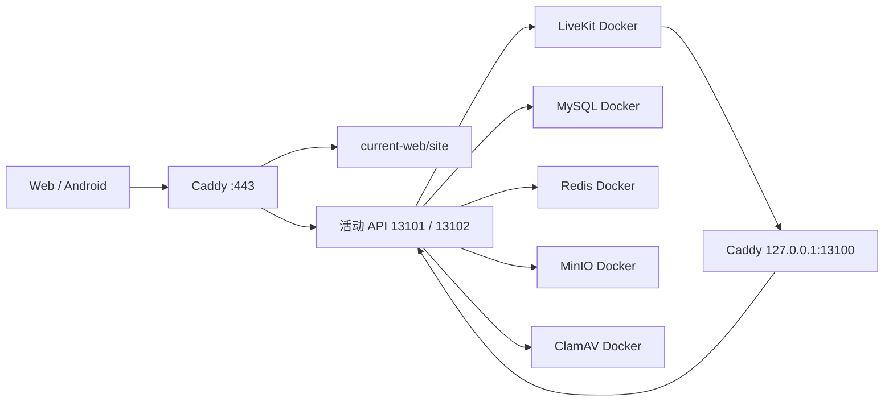

# 混合运行与快速发布架构

## 1. 目标与边界

生产环境按变更频率拆成三个独立模块：

| 模块 | 运行方式 | 稳定接口 | 发布时是否重建基础设施 |
| --- | --- | --- | --- |
| 家属/陪伴 Web 与管理员 Web | Caddy 直接托管不可变静态制品 | `openbmb-web-release promote/revert/status` | 否 |
| NestJS API | 固定 Node.js 22.19.0 + systemd 双槽位 | `openbmb-deploy-native-api deploy/recover/status` | 否 |
| MySQL、Redis、MinIO、LiveKit、ClamAV | Docker Compose | 原有受保护的完整发布流程 | 仅基础设施、数据库或安全边界变更时 |

Web、API 与基础设施之间只通过 HTTP、Redis、MySQL、S3、LiveKit 等现有协议交互。发布脚本不读取前端业务实现，Caddy 不感知具体页面，Docker 基础设施也不感知静态制品版本。

## 2. 持久化指针

```text
/opt/openbmb/current          -> 已验证的 Docker 基础设施 release
/opt/openbmb/current-app      -> 旧发布协议的安全版本与回滚锚
/opt/openbmb/current-api      -> 当前原生 API release
/opt/openbmb/current-web      -> 当前 Web release
```

`current-app` 不能复用为原生 API 指针。现有 security-epoch、备份、Compose 与回滚脚本都要求它直接指向 `/opt/openbmb/releases/*`；保留该约束可以让混合迁移不削弱已经验证的安全状态机。

原生 release 分别保存在：

```text
/opt/openbmb/hybrid/api-releases/
/opt/openbmb/hybrid/web-releases/
```

所有切换均在同一文件系统内以临时符号链接加原子 `rename` 完成，并在成功前、失败回退后同步目录元数据。
Web 发布、API 发布、运行模式切换和 Docker 慢发布统一串行于
`/run/lock/openbmb-operation.lock`；嵌套调用只接受经过 inode 与持锁状态
验证的继承文件描述符。

## 3. 请求拓扑



Caddy 的 `127.0.0.1:13100` 监听器是内部稳定端口。它与公网 API 路由读取同一个 `OPENBMB_API_UPSTREAM`，因此 LiveKit webhook 和公网请求会在同一次 Caddy reload 中切换到相同 API 槽位。`13101`、`13102` 只监听 loopback，不开放安全组端口。

## 4. 交付触发与变更边界

每次 `main` 的 CI 成功后都构建并交付 Web 与 API 两个制品，不再依赖路径过滤。
这会让纯文档提交多做一次小型快速发布，但可以避免共享依赖、构建配置或 GitHub
事件基线缺失导致应发布组件被错误跳过。API 制品若包含不兼容的 Prisma migration
摘要或 security epoch，服务端部署器仍会拒绝快速路径，不会绕过数据库与安全边界。

MySQL、Redis、MinIO、LiveKit、ClamAV 版本、数据库迁移和凭据边界的变化仍使用
Docker 全量流程。该流程只允许从 GitHub Actions 人工触发，且要求显式选择
`PRODUCTION_DELIVERY_MODE=docker-full`；普通 `main` 推送不会自动执行。

两个快速发布在上传前都会限量清理名称、所有者和年龄均符合约束的旧 incoming
项并按制品展开大小检查磁盘空间。真正 promote 前再次确认远端 `main` 未前移；
服务器在公共操作锁内要求状态严格为 `mode=hybrid`、`pending=no`，且 upstream
必须为原生 `13101/13102`，因此同 SHA 快路径也不能把 Docker `13100` 当作成功。

## 5. Web 制品契约

归档根只允许：

```text
SHA256SUMS
site/openBMB/**
site/openBMB/admin/**
```

服务端先将不可信的上传文件复制到 root-only staging，再核验归档摘要、成员类型、路径边界和逐文件摘要。制品不能包含符号链接、硬链接、设备文件、绝对路径或 `..` 路径。激活后同时检查两个入口；失败时恢复上一个指针。仅保留当前和前一个可达 release。

## 6. API 制品契约

API 归档包含 `manifest.json`、编译后的 `dist`、生产 `node_modules` 和服务包清单。manifest 记录完整 Git SHA、Node 版本、安全 epoch、Prisma migrations 摘要以及每个文件的大小和 SHA-256。

部署器只接受 Node.js `22.19.0`，并要求：

1. `current-app` 仍指向调用者声明的旧安全锚；
2. 快速发布的 migrations 摘要与当前 API 相同；
3. security epoch 与当前允许的边界兼容；
4. 候选进程在空闲槽位的 liveness/readiness 均通过；
5. Caddy upstream 的 compare-and-swap 与预期旧值一致。

任何条件失败都不会停止旧槽位。Caddy 切换失败会恢复原环境文件并 reload；只有新流量健康后才停止旧进程。

普通 API 快速发布只允许在 `mode=hybrid`、无 pending 且 Caddy 已指向
`13101/13102` 时执行；`13100` 只属于带持久化迁移日志的首次引导。完整
Docker 慢发布若改变 schema 或 security epoch，系统保持 Docker 模式，普通
`switch hybrid` 会先校验原生制品兼容性并拒绝旧制品，避免把旧 API 接到新数据库。

## 7. 首次迁移与回退

首次迁移从当前已验证的 `openbmb-api` 容器导出 Node 运行时和 API payload，避免在 4 GiB 主机上执行 `npm ci`。导出器必须核对容器镜像 revision、当前 `current-app`、Node 版本、security epoch 和 migrations 摘要。

切换顺序：

1. 安装控制脚本、systemd 模板和固定 Node 运行时；
2. 推送并激活 Web 静态制品；
3. 启动原生 API 候选槽位并直连检查；
4. 暂停占用 `13100` 的旧 Docker API；
5. 原子安装新 Caddy 配置，切换 upstream 并检查 loopback 与公网；
6. 公网持续健康后，精确移除旧 API/Web 容器；保留当前 Docker 应用镜像作为短期回滚；
7. 只删除已确认不可达的旧 OpenBMB 应用镜像和传输缓存，不运行全局 `docker system prune -a`，不触碰 CampusHub 或数据卷。

首次切换任一步失败时，恢复原 Caddyfile 与环境文件、重启原 Docker API/Web 容器，并重新执行公网健康检查。

运行时迁移日志与原生 API 发布日志都由开机恢复服务在 Caddy 之前处理。
候选 API 在提交前只启动、不加入开机 target；开机回滚通过离线 Caddy CAS
恢复环境并校验配置，避免 Caddy 尚未启动时错误执行 reload，也避免断电后
长期运行两个后台 worker。
